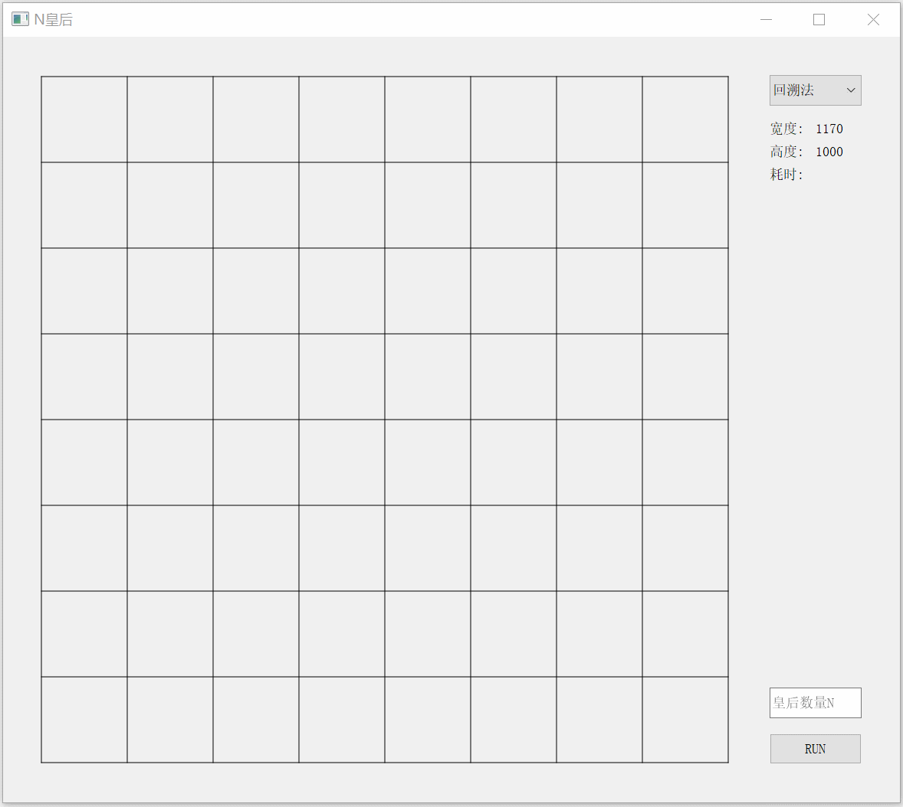

# NQueens

## N皇后问题

**N皇后**问题是对经典八皇后问题的扩展。

**八皇后问题**是一个以国际象棋为背景的问题：如何能够在8×8的国际象棋棋盘上放置八个皇后，使得任何一个皇后都无法直接吃掉其他的皇后？为了达到此目的，任两个皇后都不能处于同一条**横行**、**纵行**或**斜线**上。八皇后问题可以推广为更一般的**n皇后**摆放问题：这时棋盘的大小变为*n*×*n*，而皇后个数也变成*n*。当且仅当*n* = 1或*n* ≥ 4时问题有解。

## 项目简介

该项目用Qt编写，可选择回溯法、遗传算法、模拟退火、爬山法四种算法，输入皇后数量n，点击运行按钮“RUN”即可显示通过该算法找到的N皇后的一个解，并显示算法所用时间。

## 已完成

- [x] 界面设计
- [x] 回溯法集成
- [x] 遗传算法集成
- [x] 模拟退火算法集成
- [x] 爬山法集成

## TODO

- [ ] 更改回溯法逻辑为找到一种解法即不再继续寻找后续的解
- [ ] 其它性能优化